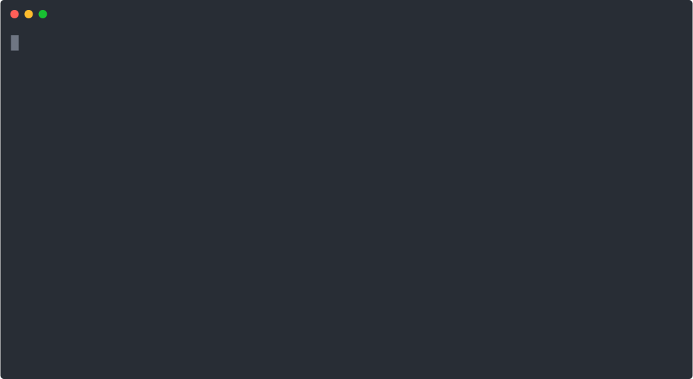

## Overview

This explains how I have configured things to record terminal sessions.

## Tooling

Install 2 tools:

- [Asciinema](https://github.com/asciinema/asciinema): `pip install asciinema`
- [svg-term-cli](https://github.com/marionebl/svg-term-cli): `npm install
  svg-term-cli`
	- Optionally install globally with `-g`
	- If installing locally, then do:
	  ```sh
	  alias svg-term=<path-to-node-modules>/svg-term-cli/lib/cli.js
	  ```
	
## Configuration

I love my [oh-my-zsh](https://ohmyz.sh/) terminal, but the prompt is a bit busy
and distracting in a screen recording. When running `asciinema` it starts up a
fresh copy of your shell, and sets a variable `ASCIINEMA_REC`. I've got this in
my `~/.zshrc` to set a simpler prompt:
	
```sh
if [[ $ASCIINEMA_REC = 1 ]]; then PROMPT="> "; unset RPROMPT; fi
```

## Recording

I'm finding that the defaults work well, but if expecting long delays while you
think about what to type, I find adding `-i 1` helps tighten things up a bit
(limit recorded terminal inactivity to max 1 second).

Even with the `PROMPT` reset that I'm doing in my `~/.zshrc`, I still find some
stray artifacting if I resize the final SVG output (see below). Instead what
works better is to change the size of your terminal window to whatever size
you'd like it to be - the final SVG is nice and tidy that way.

`asciinema rec recording.cast`

## SVG Conversion

I like adding some window chrome to the final SVG. Doing that also adds just
enough padding that it doesn't feel crowded.

`cat recording.cast | svg-term --window > recording.svg`

## A Simple Example


